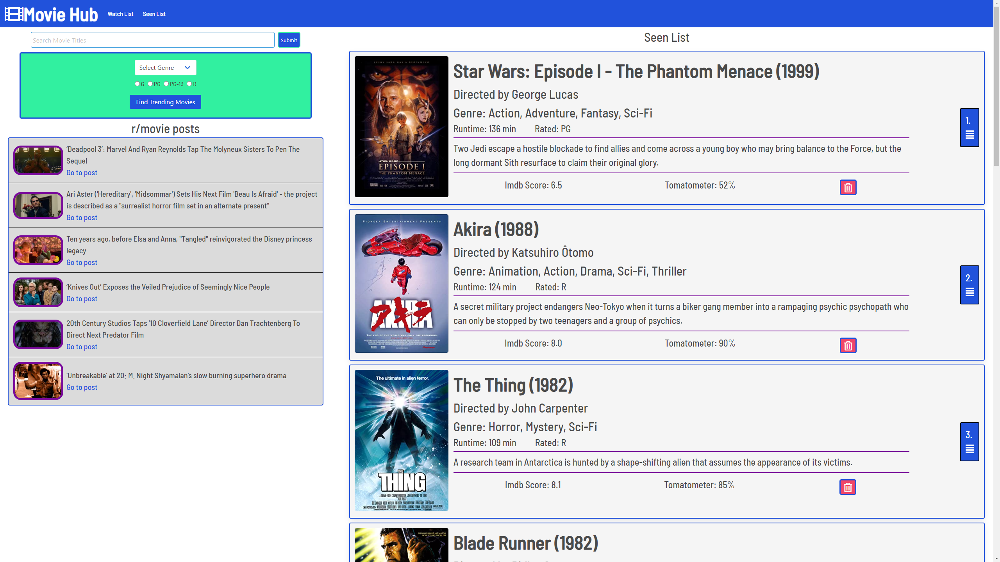

# <strong>movie-hub</strong>

The name of this application is <i>Movie-hub</i> it is designed to enhance the movie experience of its user. It is an app that makes it possible for the user to create a list of intended movies to watch and seen movies. The user is able to search any movie's they can think of or get inspired by the features that can suggest movies to the user.

<strong>Description</strong>
This application allows the user to be able to add movies the user intends to watch and movies the user has already watched. The second list the user is able to sort the movies that they have seen by dragging and dropping the movie using the blue numbered tabs. The user is also able to check what movies are currently trending by choosing a genre and rating. If they look down to the r/movies section they can see and go to articles posted by users from the associated subreddit, with over 24 million members.

<strong>Technology used</strong>
This app runs in the browser and with the help of HTML and CSS powered by javaScript, JQuery, and draggable. The Bulma CSS framework was used for the styling while OMDb, Tmdb, and Reddit APIs were used for the movie info. Other third-party assets include font-awesome, and google fonts.

<strong>Image</strong>

<strong>Installation</strong>
This project does not need any installation,rather it is currently hosted on github, which can be accessed by clicking on the link below
https://clintonstrange.github.io/movie-hub/
Or by going to the repo:
https://github.com/clintonstrange/movie-hub

<strong>Usage</strong>
This app is functional, responsive, simple and easy to use. It allows the user to make a list of must-watch and seen movies.The app can be accessed using a smart phone, tablet, and computer. It allows the user to enter a movie name in the search window, and clicking the button brings out the name of the movie, the year it was made, Director and an overview of the movie.

<strong>Contributors</strong>
Clinton strange;
Christian Bissinger; akira941@gmail.com
Sylvester Nwizu; nwizutoks@gmail.com

<strong>Resources used</strong>
https://bulma.io/
https://jquery.com/
https://developers.themoviedb.org/3/getting-started/introduction
http://www.omdbapi.com
https://www.reddit.com/dev/api/
https://shopify.github.io/draggable/
https://fontawesome.com/icons?d=gallery&m=free
https://fonts.google.com/
